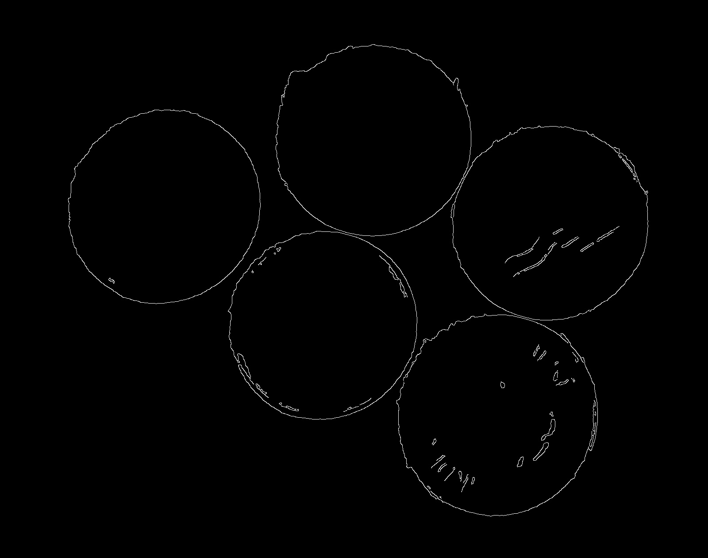
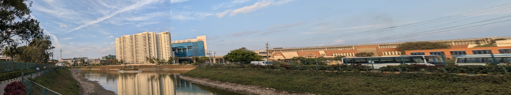

# Coin Segmentation and Counting

## **Overview**
This project performs **coin segmentation and counting** using **OpenCV and Python**. The process includes:
- Detecting **edges and contours** in an image.
- Applying **region-based segmentation** to isolate individual coins.
- Converting the image to **HSV color space** for better segmentation.
- Applying **gray color masking** to focus on coin regions.
- Using **Hough Circle Transform** to detect and count circular objects.
- Displaying **segmented coins** and labeling them with their count.

## **How to Run the Code**
### **1. Install Required Dependencies**
Before running the Jupyter Notebook, install the required libraries using:
```bash
pip install opencv-python numpy matplotlib
```

### **2. Open the Jupyter Notebook**
Start Jupyter Notebook using:
```bash
jupyter notebook
```
Then open the notebook file (`coin_segmentation.ipynb`).

### **3. Run the Notebook Cells**
- Load the image.
- Preprocess the image (convert to **HSV**, grayscale, thresholding, morphological operations, edge detection).
- Detect and segment the coins.
- Show the results, including detected coins and individual coin images.

## **Methods Used**
### **1. Preprocessing**
- Convert the image to **HSV color space** to handle lighting variations.
- Apply **gray color masking** to isolate potential coin regions.
- Apply **Gaussian Blur** to remove noise.
- Use **adaptive thresholding** and **morphological operations** to refine edges.
- Apply **Canny edge detection** to highlight coin boundaries.

### **2. Contour Detection and Filtering**
- Detect contours using `cv2.findContours()`.
- Filter contours based on **area and hierarchy** to remove noise.

### **3. Hough Circle Transform for Coin Detection**
- Apply `cv2.HoughCircles()` to detect circular objects (coins).
- Label detected coins with numbers using `cv2.putText()`.

## **Results and Observations**
- The algorithm **successfully detects and counts** coins in various images.
- **HSV conversion** improves detection in images with **lighting variations**.
- **Gray color masking** helps in filtering out non-coin regions.
- **Hough Circle Transform** improves accuracy in detecting circular objects.
- Some **false detections** may occur if background noise is not removed properly.
- False detection can also occur if coins are **shiny**, more illumination.
- Adjusting **morphological operations and Hough Transform parameters** can improve accuracy.

## **Dependencies**
To run this project, you need:
- Python 3.x
- Jupyter Notebook
- OpenCV (`cv2`)
- NumPy
- Matplotlib

  ## **Sample Outputs**
### **Detected Coins**

### **Segmented Coins**


---

# Panorama Stitching

## **Project Overview**
This project performs **panorama stitching** using **SIFT-based feature detection and homography transformation**. The process includes:
- Detecting **key points in overlapping images**.
- Matching key points using **Brute-Force Matcher with Euclidean distance**.
- Computing **homography using RANSAC** to align images.
- Warping images and blending them into a **seamless panorama**.

## **How to Run the Code**
### **1. Install Required Dependencies**
Before running the Jupyter Notebook, install the required libraries using:
```bash
pip install opencv-python numpy matplotlib
```

### **2. Open the Jupyter Notebook**
Start Jupyter Notebook using:
```bash
jupyter notebook
```
Then open the notebook file (`panorama_stitching.ipynb`).

### **3. Run the Notebook Cells**
- Load three overlapping images.
- Extract key points and match them using **SIFT**.
- Compute **homography** and warp images to align them.
- Generate and display the final **stitched panorama**.

## **Methods Used**
### **1. Keypoint Detection and Matching**
- Convert images to **grayscale**.
- Detect **SIFT keypoints and descriptors**.
- Use **Brute-Force Matcher** to find corresponding points.
- Sort matches by distance to keep the best ones.

### **2. Homography Computation**
- Extract matched keypoints from both images.
- Compute **homography matrix** using **RANSAC** to remove outliers.
- Apply **perspective warping** to align the images.

### **3. Stitching Three Images Together**
- Load `Image1.jpeg`, `Image2.jpeg`, and `Image3.jpeg`.
- Call `stitch_three_images(img1, img2, img3)`, which:
  - Stitches `img1` and `img2` first.
  - Stitches the result with `img3`.
  - Outputs the final **stitched panorama**.
- Display the result using `display(Image.fromarray(final_panorama))`.
- Save the output as `panorama_output.jpg`.

## **Results and Observations**
- **SIFT-based feature detection** successfully detects key points in images.
- **Homography transformation** aligns images correctly.
- **Brute-Force Matching** provides good feature correspondences.
- Some **seams may be visible**—improving blending techniques can help.
- If keypoints are **poorly matched**, homography may fail.

## **Dependencies**
To run this project, you need:
- Python 3.x
- Jupyter Notebook
- OpenCV (`cv2`)
- NumPy
- Matplotlib

## **Sample Outputs**
### **Panorama**

